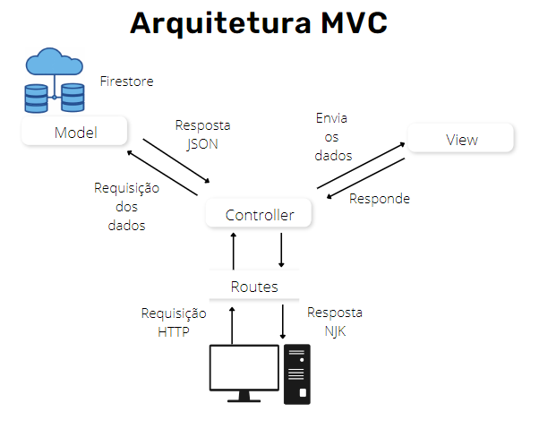

<h1 align="center">
    DoeAqui
</h1>

  <a href="#-tecnologias">Tecnologias</a>&nbsp;&nbsp;&nbsp;|&nbsp;&nbsp;&nbsp;
  <a href="#-sobre">Sobre</a>&nbsp;&nbsp;&nbsp;|&nbsp;&nbsp;&nbsp;
  <a href="#-arquitetura">Arquitetura</a>&nbsp;&nbsp;&nbsp;|&nbsp;&nbsp;&nbsp;
  <a href="#-desenvolvedor">Desenvolvedor</a>

 

## 🚀 Tecnologias

Tecnologias utilizadas:

- [Maps JavaScript API](https://developers.google.com/maps/documentation/javascript/overview)
- [Firebase](https://firebase.google.com/)
- [Node](https://nodejs.org/en/)
- [Express](https://expressjs.com/pt-br/)
- [Nunjucks](https://mozilla.github.io/nunjucks/)
- [Method-override](https://www.npmjs.com/package/method-override)

 

## 💻 Sobre
Em 2022, no Brasil, de acordo com uma pesquisa realizada pela Rede Brasileira de Pesquisa em Soberania e Segurança Alimentar e Nutricional (Rede Pensam), aproximadamente 33,1 milhões de pessoas passam fome. Além disso, ao todo cerca de 125,2 milhões estão situadas em algum grau de insegurança alimentar.

O DoeAqui busca auxiliar na localização e gerenciamento do centro de doação mais próximo do usuário. Dessa forma, por meio de uma simples busca, qualquer pessoa poderá encontrar e se dirigir a um centro de doação seja para contribuir, ou para receber auxílio.

 

## 📁 Arquitetura

 

## 👨🏽‍🎓 Desenvolvedor

Ronald Almeida
 

Faculdade - [Instituto Federal de Educação, Ciência e Tecnologia de São Paulo - IFSP Câmpus Campinas](https://portal.cmp.ifsp.edu.br/)